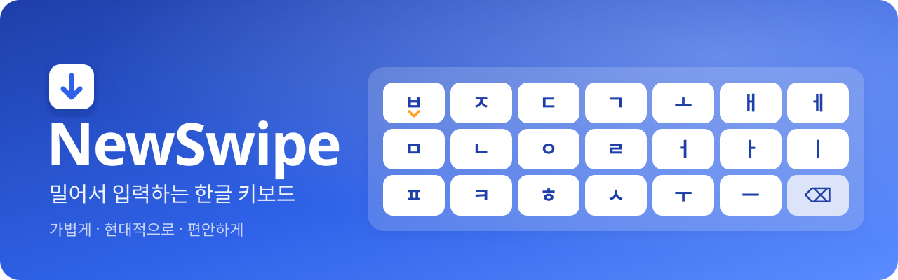
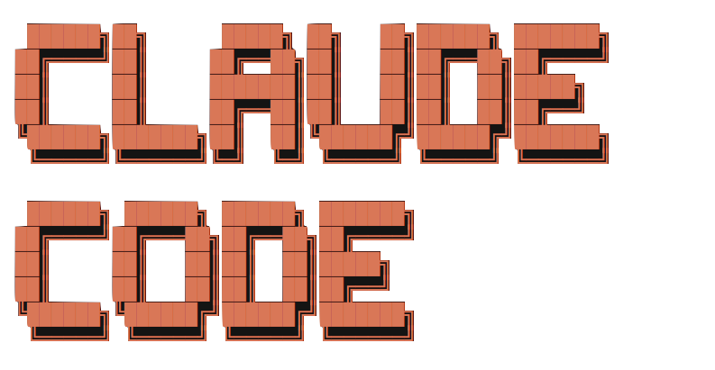

# NewSwipe
<p align="center">
  
</p>
NewSwipe는 가볍고 현대적이며 편안한 한글 입력 시스템입니다.
<br />
<br />
<p align="left">
  <a href="https://github.com/TechTree-Alt/NewSwipe/releases/latest"></a>
</p>
<br />

## 핵심 가치

### 가벼움 (Lightweight)

입력 시스템은 항상 백그라운드에서 상주하며 언제 어느 상황에서나 적절하게 반응해야 합니다.  
NewSwipe는 자원 소모를 최소화하여 빠르고 기민하게 반응합니다.  
View를 최소한으로 그리고 외부 라이브러리를 최소한으로 사용합니다.  
앱 크기는 1MB 미만, 램 점유율은 90MB 미만입니다 (안드로이드 16, 램 16GB 기기 기준).  

### 현대적 (Modern)

가볍고 최적화가 잘 되어 있는 앱이라고 해서 딱딱하고 불친절할 필요는 없습니다.  
NewSwipe는 최신 안드로이드 API와 기능을 적극적으로 사용해 트렌드를 따라갑니다.  
Material 3 Expressive에서 영감을 받은 UX를 사용하며, 다크 모드, Predictive Back Design, Emoji 18.0을 지원합니다.  
가벼움을 유지하면서도 현대적인 입력기의 다양한 편의 기능(클립보드, 단어 추천, 단어 학습)을 제공합니다.  

### 편안함 (Comfortable)

입력 시스템은 스마트폰에서 가장 많이 쓰는 앱 중 하나이며, 동시에 가장 개인적인 앱이기도 합니다.  
NewSwipe는 하나의 경험을 모두에게 강제하지 않고, 다양한 사용 방식을 가진 사용자를 위해 다양한 사용자화 기능을 제공합니다.  
자신에게 딱 맞는 편안한 입력을 위해, 단 하나뿐인 입력 시스템을 직접 만드세요.  
<br />

## 특징
- 기존 사용자들에게 친숙한 기본 단모음에 **밀어서 입력** 방식을 더하여 종성-초성 겹침 문제를 해결합니다.
- 쌍자음, 겹받침, 이중모음을 **밀어서 입력**하여 최소한의 움직임으로 빠르고 정확하게 입력합니다.
- 양손 사용에 최적화된 **NewSwipe 단모음** 배열을 사용해 보세요.
- 자음을 왼손, 모음을 오른손에 분리하는 **균형 레이아웃**으로 예측 가능하고 박자감 있게 입력하세요.
- 가로 상태나 큰 화면에서도 **양쪽으로 분리 기능**으로 편안하게 사용하세요.
- **기능 키 (?123·🌐·␣·↵·⇧·⌫)의 유무와 순서**를 마음대로 조정하세요.
- 모든 키를 길게 누를 때와 상하좌우로 밀 때 어떤 일이 일어날지를 **직접 사용자화**하세요.
- **한국어의 특수성을 고려**한 단어 추천, 자동 수정, 학습 기능을 통해 편안한 환경을 만듭니다.
- **도구 막대**에서 유용한 기능들을 편하게 사용할 수 있습니다.
- 강력한 **클립보드** 기능으로 복사된 내용들을 효율적으로 관리하세요.
- **이모지 창**에서 최신 이모지를 효율적으로 찾고 고정하세요.
- **한 손 모드**를 사용자화해 자신에게 맞는 위치와 크기로 편하게 한 손을 쓰세요. 
<br />

## 한글 자판

설정 › 자판 레이아웃에서 두 가지 배열 중 고를 수 있습니다.

**단모음** · 친숙한 기본 단모음 배열
```
 ㅂ  ㅈ  ㄷ  ㄱ  ㅅ  ㅗ  ㅐ  ㅔ
 ㅁ  ㄴ  ㅇ  ㄹ  ㅎ  ㅓ  ㅏ  ㅣ
     ㅋ  ㅌ  ㅊ  ㅍ  ㅜ  ㅡ  ⌫
```

- 각 자음 키를 아래로 밀어 된소리 (ㅃ·ㅉ·ㄸ·ㄲ·ㅆ)를 입력합니다.
- 각 모음 키를 두 번 연속 누르거나 아래로 밀어 ㅣ계 이중모음 (ㅑ·ㅕ·ㅛ·ㅠ·ㅒ·ㅖ)을 입력합니다.

**NewSwipe 단모음** · 거센소리 일부를 빼 키의 크기를 키운 새로운 단모음 키보드
```
 ㅂ  ㅈ  ㄷ  ㄱ  ㅗ  ㅐ  ㅔ
 ㅁ  ㄴ  ㅇ  ㄹ  ㅓ  ㅏ  ㅣ
 ㅍ  ㅋ  ㅎ  ㅅ  ㅜ  ㅡ  ⌫
```

- 사용량이 적은 거센소리 중 일부를 빼고, 자주 입력하는 ㅅ과 ㅎ을 손가락이 잘 닿는 곳으로 옮겼습니다.
- 각 자음 키(ㅂ·ㅈ·ㄷ·ㄱ)를 오른쪽으로 밀어 거센소리 (ㅍ·ㅊ·ㅌ·ㅋ)를 입력합니다.
- 모음 배열은 기본 단모음과 같아 적응이 빠릅니다.
<br />

## 주요 기능

| 기능 | 내용 |
|---|---|
| 밀어서 입력 | 키를 아래로 밀면 쌍자음·ㅣ계 이중모음(ㅑ·ㅕ·ㅛ·ㅠ), 위·왼쪽·오른쪽으로 밀면 겹받침(ㄺ·ㄻ…)과 조합형 이중모음(ㅘ·ㅝ…)이 입력됩니다. 방향별 글자는 직접 바꿀 수 있고, 기존 단모음처럼 같은 자음을 두 번 눌러 쌍자음을 입력하는 방식도 선택할 수 있습니다. |
| 길게 눌러 입력 | 키마다 숫자·특수문자·악센트 문자(₩ $ € é ñ…)를 고를 수 있고, 목록도 직접 편집합니다. |
| 스페이스바·⌫ 밀기 | 스페이스바를 좌우로 밀면 커서가 글자 단위로, 위아래로 밀면 줄 단위로 움직입니다. ⌫를 왼쪽으로 밀면 단어를, 위로 밀면 줄의 왼쪽을 지웁니다. |
| 단어 추천 | 한국어·영어 단어 추천, 자동 수정, 자주 쓰는 단어 학습을 제공합니다(추천·자동 수정은 기본 꺼짐). 비밀번호·이메일·시크릿 모드 입력란에서는 동작하지 않습니다. |
| 도구 막대 | 클립보드·이모지·음성 입력·실행 취소·한 손 모드·설정·키보드 숨기기 버튼이 있습니다. 버튼의 순서, 위치(왼쪽·오른쪽), 표시 여부를 바꿀 수 있습니다. |
| 클립보드 | 복사한 텍스트와 이미지를 최근 30개(이미지는 5개)까지 모아 둡니다. 고정은 최대 10개이고, 나머지는 24시간 뒤 지워집니다. 민감 정보로 표시된 복사는 저장하지 않습니다. |
| 이모지 | Emoji 18.0과 피부색 변형, 한글·영어 검색, 최근·고정 이모지를 지원합니다. |
| 한 손 모드 | 자판과 도구 막대를 왼쪽이나 오른쪽으로 모읍니다. 도구 막대 버튼으로 켜고 끄며, 자판 폭·키 높이·세로 위치를 정할 수 있습니다. |
| 자판 모양 | 자음은 왼쪽, 모음은 오른쪽으로 나누는 균형 레이아웃, 격자 정렬, 숫자 줄, 키 높이·글자 크기·여백을 설정합니다. 가로 모드와 큰 화면(실험실)에서는 따로 정한 분리 키보드를 쓸 수 있습니다. |
| 사용자화 | 맨 아래 줄 키의 순서와 유무, 한글 자판의 Shift 자리에 놓는 Fn 키를 정합니다. 기능키·도구 막대·키보드를 밀거나 길게 누를 때 실행할 기능(커서 자유 이동, 두 손가락 실행 취소·다시 실행, 붙여넣기 등)도 직접 고릅니다. |
| 기본 입력 | 영어 QWERTY(Shift 두 번 = 고정), `?123` 기호 자판 두 쪽, 숫자 입력란용 숫자 자판이 있습니다. 영어 자동 대문자, 스페이스바 두 번으로 마침표, 키 진동·소리·미리보기와 ⌫·스페이스바 인식 범위 좁히기를 설정할 수 있습니다. |
| 테마 | 시스템·라이트·다크 모드와 강조 색을 고릅니다. |
| 설정 가져오기·내보내기 | 설정을 파일로 저장하고 불러옵니다. 학습한 단어·이모지·클립보드 기록을 담을 때는 비밀번호로 암호화할 수 있습니다. |
| 첫 시작 가이드 | 처음 열면 키보드 켜기와 밀어서 입력 연습을 안내하고, 다른 기기에서 내보낸 설정을 바로 가져올 수도 있습니다. |
<br />

## 개인정보

- 인터넷 권한이 없으므로 어떤 데이터도 외부로 보내지 않습니다.
- 학습한 단어와 클립보드 기록(텍스트·이미지)은 앱 전용 저장소에만 저장되며 시스템 백업에는 포함되지 않습니다(`allowBackup=false`).
  설정에서 저장을 끄거나 모두 지울 수 있습니다.
- 비밀번호·이메일 입력란과 앱이 학습하지 말라고 표시한 입력란(시크릿 모드 등)에서는 단어를 학습하지 않습니다.
- 설정 내보내기에서 학습한 단어·이모지·클립보드 기록(텍스트만)을 직접 고른 경우에만 백업 파일에 담기며,
  이때 비밀번호로 파일 전체를 암호화할 수 있습니다 (AES-256-GCM, 키는 PBKDF2-HMAC-SHA256으로 만듦).
<br />

## 영감을 받은 곳

NewSwipe의 자판과 입력 방식은 아래 작업들에서 아이디어를 얻었습니다. 다만
이 프로젝트와 개발자는 아래 개발자·디자이너와 관계가 없습니다.

- **구글 단모음** — 2010년 'Google 한국어 입력기'에 처음 실린 단모음 자판.
- **커키 키보드** — 단모음 자판에서 쌍자음을 키를 아래로 밀어 입력하는 방식.
- **오쏘리니어(ortholinear) 키보드** — 격자 정렬.
<br />

## 고지사항

<p align="left">
  </a>
</p>
NewSwipe는 비전공자가 Claude Code(Sonnet 5.5, Opus 5.5)를 사용해 만든 프로젝트입니다.
모든 아이디어와 검수는 개발자가 했으며, Claude Code를 통해 주요 기능을 구현하였습니다.
<br />
<br />


## 라이선스

- NewSwipe의 소스 코드는 [Apache License 2.0](LICENSE)을 따릅니다. Copyright 2026 Alternative.
  "NewSwipe"라는 이름과 로고를 상표로 사용할 권리는 이 라이선스에 포함되지 않습니다
  (Apache License 2.0 제6조). 이 코드로 앱을 만들 때는 다른 이름과 아이콘을 쓰세요.
- **NewSwipe 단모음** 배열 디자인은 [CC BY-NC 4.0](LICENSE-LAYOUT.md)을 따릅니다. 비영리 목적으로는 출처를 밝히고 자유롭게 쓸 수 있고,
  **영리적인 다른 키보드 앱에서 쓰려면 저작자의 허락이 필요합니다** (Apache License 2.0은 이 배열 디자인의 권리를 별도로 주지 않습니다).
- 이모지 데이터는 Unicode License v3, 한국어 단어 사전은 CC BY 4.0(Leipzig Corpora Collection),
  영어 단어 사전은 MIT(SymSpell)·CC BY 3.0(Google Books Ngram)·SCOWL 라이선스를 따릅니다.
  자세한 내용은 [THIRD_PARTY_NOTICES.md](THIRD_PARTY_NOTICES.md)를 보세요.
